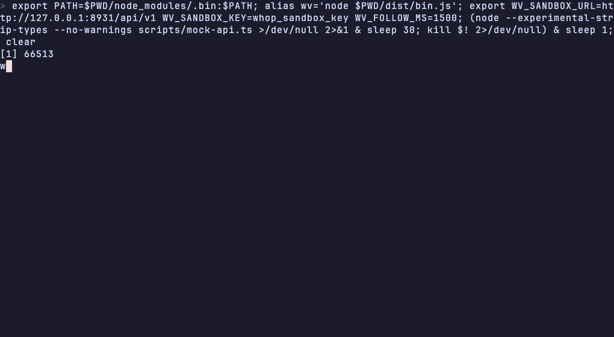
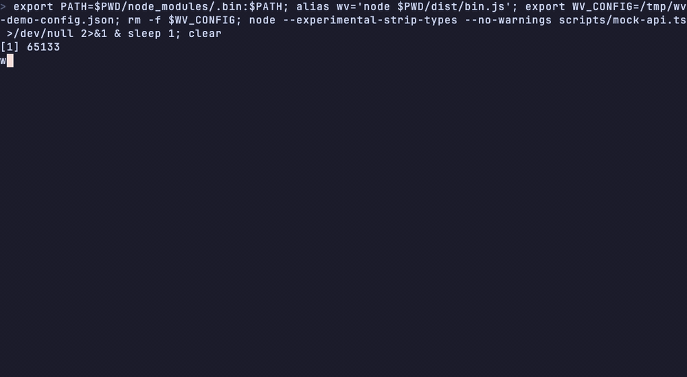

# whop-view

`wv` wraps the [Whop CLI](https://whop.sh) for the two kinds of caller it has, and ships five skills that put an agent to work on top of it.

For an agent or a script on a pipe, every read is `whop`'s own bytes, and around them `wv` adds what an agent needs and the CLI does not give: a write comes back as a plan to approve instead of running, the exit code says what went wrong, the screens come back as JSON, `--all` follows the cursor, and `wv agent <group>` is a manifest sized for a context window. For a person at the terminal, it asks `whop` for JSON and renders a table, a card, a confirmation, or an error.

The skills are the point. [`whop-gtm`](skills/whop-gtm/SKILL.md) runs go-to-market, [`whop-store`](skills/whop-store/SKILL.md) runs the storefront, [`whop-money`](skills/whop-money/SKILL.md) runs treasury, [`whop-support`](skills/whop-support/SKILL.md) works tickets, and [`whop-dev`](skills/whop-dev/SKILL.md) ships apps and webhooks. Each is a short file of rules and a map, references loaded only when a playbook runs, a command map regenerated from the live CLI, and evals that run the scenarios through `claude -p` against a fake `whop` and judge what the agent did. They share one gate: nothing writes until the person has seen the plan.

The design is in [VIEWS.md](./VIEWS.md). This README shows it: [the skills](#the-skills), [what agents see](#what-agents-see), [the screens](#the-screens) each skill stands on, then [the people layer](#the-people-layer).

> Unofficial, personal-use prototype. Not affiliated with, endorsed by, or distributed by Whop. "Whop" is a trademark of its owner. Built against `whop` 0.18.2, API 2026-09-15.

## Why

The CLI shipped agent-first, and neither of its callers is well served yet.

For an agent: `whop --llms-full` tags 149 commands "confirm with the user before executing" and enforces none of it, so a model with shell access is one token away from a payout. Every failure exits 1, so a script cannot branch without parsing the body. The documented `--filter-output` syntax returns nothing on a list. Nothing follows a cursor. `--llms` is 16 KB with no flags and `--llms-full` is 338 KB, and neither fits a turn. The one skill `whop skills add` installs says nothing about ads, audiences, bounties, stats, prices, refunds, disputes, payouts, or webhooks, and nothing about when to stop.

For a person: every command prints every field as TOON, so two products are 69 lines with no columns, no alignment, and ISO timestamps. `--format md` prints `[object Object]` for nested fields. Errors are two lines. `payouts create` moves real money with no confirmation and no dry-run flag. A sandbox host exists, but the CLI reaches it only through `WHOP_API_BASE_URL` with a separate key, and the docs say there is no sandbox mode. Objects and arrays have to be typed as JSON on the command line.

`wv` answers both from one core: inference rules plus small hint files classify every field of every response, so each command group gets the people layer for free, and the same plan a person confirms on a card is the JSON an agent gets on a pipe. `WV_RAW=1` turns all of it off.

## Install

```bash
git clone https://github.com/srikarsunchu/whop-view && cd whop-view && pnpm install && pnpm build && pnpm link --global
```

Needs Node 22 or newer and a working `whop` on your PATH. Then use `wv` anywhere you would type `whop`.

```bash
pnpm skill
```

Regenerates each skill's command map from the live `whop`, copies the shared gate into each, and installs all five into `~/.claude/skills`. Claude Code picks them up by their descriptions: "launch", "price", "refund", "payout", "webhook", and the rest each route to the right one.

```bash
pnpm eval [skill]
```

Runs a skill's scenarios through `claude -p` against `tests/fake-whop.sh`, so no real account is touched, and judges the transcript: doctor before any write, the plan shown before the approved rerun, never `--yes`, never raw `whop` for a write, the done-when read at the end. The last runs are committed in each skill's `evals/results.md`.

## MCP

```bash
wv --mcp
```

The same agent face as a Model Context Protocol server on stdio, for a client that never opens a terminal. Four tools: `wv_manifest`, `wv_read`, `wv_screen`, `wv_write`. `wv_write` never writes on the first call: it returns the plan and a `rerun`, and the second call with that `rerun` runs it, under the same signed approval and idempotency key the pipe uses. `whop --mcp` serves 298 tools and `payouts_create` on it moves money on the first call; this one asks first. Register it with Whop's own installer:

```bash
whop mcp add --agent claude-code --command "wv --mcp"
```

## The skills

| skill | job | its screen | its recipes | last eval |
|---|---|---|---|---|
| [`whop-gtm`](skills/whop-gtm/SKILL.md) | launch, retarget, scale, report | `wv gtm` | `wv gtm launch`, `wv gtm winback`, `wv gtm rank` | 26/26 |
| [`whop-store`](skills/whop-store/SKILL.md) | prices, publishing, plans, promo codes, checkout links | `wv store` | `wv store price`, `wv store publish` | not run yet |
| [`whop-money`](skills/whop-money/SKILL.md) | balances, payouts, month end, reconcile | `wv money` | `wv money close` | 20/20 |
| [`whop-support`](skills/whop-support/SKILL.md) | who is this customer, refund, dispute, cases | `wv support lookup` | `wv support refund`, `wv support dispute` | 21/22 |
| [`whop-dev`](skills/whop-dev/SKILL.md) | ship, webhook, domain, logs, keys | `wv dev` | `wv dev hook` | 11/14 |

Every skill has the same shape, so an agent that has run one knows the others:

- **Rules.** Seven or eight, each about using `wv` the way it expects rather than working around `whop`: read the screen first, every write goes through `wv`, retries cannot double-spend, read the manifest not your memory, and the group's own hazards: a dispute has a clock, a price change is a diff not a number, instant is a permission not a speed, deploy owns the terminal.
- **A loop.** The groups by stage. Know, segment, make, launch, convert, distribute, measure, decide for GTM. Know, price, sell, discount, prove for the store. Know, move, close, reconcile, fix for money. Find, read, act, prove for support. Know, build, hook, domain, secure for dev.
- **Preflight.** `wv doctor --format json`, then the skill's own screen as JSON.
- **Playbooks.** One reference file each, with the commands, what the plan shows, what blocks it, and the reads that prove it is done. Nothing is done when a write returned an id: a refund is done at `succeeded`, a payout at `completed`, a price at `plans get`, a webhook when a delivery succeeded, a domain at `active`.
- **Deciding and failing.** A rubric for what to do next and a failure map of every refusal and error the groups return, in the recorded message, with the fix.
- **References loaded on demand.** `references/commands.md` is generated from `--schema` by `pnpm skill`; `references/gate.md` is the shared gate; the rest are the playbooks. The `SKILL.md` itself stays short enough to sit in every turn.

[`gate.md`](skills/_shared/gate.md) is the contract all five share. Without consent `wv` runs nothing: in a pipe a write exits 2 with the plan and a `rerun`; the agent shows the plan, gets a yes, and runs `rerun` exactly as given. `rerun` carries an `--approve` token that is a signature over that argv, the host, and a ten-minute expiry, and an `--idempotency-key` minted at the plan step, so the write that runs is the one the person saw and a retry cannot write twice. A refusal is the same envelope with no `rerun`, and a blocked recipe is a stop, not a menu: the agent never runs the plan's steps by hand through `whop` to do the part that would have worked.

The evals are where that contract meets a model. The gtm, money, and support runs pass their checks; the dev run does not yet, and its `results.md` says why: asked to add a webhook on an OAuth login, the agent guessed at `whop auth switch` and four other spellings instead of reading the fix `wv dev --format json` had already handed it. That transcript is the reason the dev rules now open with the API-key rule. The store skill is newest and has no run yet.

### `report`

The Monday brief as one read. `wv report` shows six numbers this week against last with the change, what blocks a sale or a launch with each fix, the money and whether payouts are allowed, the store, every live campaign ranked by the decide rubric, Whop's recommendations waiting for a yes, and a `next` list of the `wv` commands all of that implies. `--format json` is the same as data; `--md` is Markdown for a schedule to post. It writes nothing, so it can run unattended.


The recording is live on the demo account: the identity block and the missing pixel are real, and the recommendations section shows the Economic Intelligence 403 with its fix in `next`.

### `setup`

The first hour as a numbered list. `wv setup` turns the doctor's checks into steps with who does each: wv runs it as a plan, the person does it in a browser at the URL shown, or an interactive `whop` command runs in a terminal. Blocking checks come first, and `wv setup` again says what is left.


Live on the demo account: identity leads because it blocks payouts, and most of the rest are browser steps only the person can finish.

## What agents see

Reads: the bytes are whop's. `wv products list | cat` is byte-identical to `whop products list`, and there is a test for it, so a script or a skill written against `whop` works unchanged with `wv` in its place. What changes is around the bytes:

- the exit code says what went wrong: 3 bad request, 4 not allowed, 5 not found, where `whop` says 1 for all of them
- `--all` follows the cursor and streams every row
- `--last 7d`, `--this month`, and `--last month` resolve to `--from` and `--to` before `whop` runs
- dotted paths, repeated flags, and `@file` assemble to the JSON flag `whop` expects
- a bad preset or a missing `@file` comes back as a JSON envelope on stdout, exit 2, instead of a stderr line

`wv` execs `whop` with the original argv whenever `--format`, `--full-output`, `--filter-output`, `--llms`, `--schema`, `--help`, or any `--token-*` flag is present, when `WV_RAW=1`, or when the command owns the terminal itself: `login`, `logout`, `quickstart`, `upgrade`, `apps dev|deploy|init|pull`. Only the exit status is mapped even then; `WV_EXIT=whop` keeps whop's.

`--sandbox`, `--width`, `--plan`, `--all`, and `--yes` are `wv`'s own flags and are stripped before the exec, so `wv --sandbox products list | cat` is `whop products list` against the sandbox host.

Writes: the same gate a person gets, as JSON. `whop --llms-full` marks 149 commands "Confirm with the user before executing this destructive command" and enforces none of it, and there is no `--dry-run`. So a write in a pipe without consent never reaches `whop`. It exits 2 with the plan and the command that runs it:

```
$ wv payouts create --amount 5 --payout_method_id potk_x | cat
{
  "ok": false,
  "error": { "code": "CONFIRMATION_REQUIRED", "message": "whop payouts create --amount 5 --payout_method_id potk_x writes to production. wv did not run it.", "hint": "Show the plan to the person. Rerun the command in `rerun` to run it, or add --plan to see the plan and run nothing." },
  "plan": { "kind": "write", "command": "whop payouts create --amount 5 --payout_method_id potk_x", "account": { "id": "biz_…", "title": "Frame" }, "money": { "amount": 5, "currency": "usd" }, "balance": { "available": 18.56, "currency": "usd" }, "cap": 500, "limit": { "speed": "standard", "max": 0, "code": "kyc_completed", "message": "Please complete identity verification before requesting a withdrawal." } },
  "rerun": ["wv", "payouts", "create", "--amount", "5", "--payout_method_id", "potk_x", "--idempotency-key", "…", "--approve", "1789994037.25358a43…"],
  "meta": { "command": "payouts create", "wrapper": "wv", "mode": "production" }
}
```


`rerun` carries `--approve <token>`, not `--yes`. The token is a signature over that exact command and host with a ten minute expiry, minted with a secret only this machine holds, so the write that runs is the one the person saw: an edited command, a stale approval, or a token from another machine is refused with `APPROVAL_INVALID` or `APPROVAL_EXPIRED` and nothing runs. `--yes` still works for a person at a keyboard, or for a script that chooses the honor system on purpose.


`rerun` also carries an `--idempotency-key` wv minted at the plan step when the verb takes one, so the approved retry cannot write twice; the terminal card shows the same key. Which verbs count as writes comes from whop's own manifest, fetched once a day, with wv's list underneath, so a verb that ships tomorrow is gated tomorrow. For a write against one record, `wv` reads the record first and the plan says what changes, so `products update` shows `title  Hypermotion → Hypermotion Pro` and `products unpublish` shows `visibility  visible → hidden`; the terminal card gets the same `Changes` section.

The agent shows the plan to the person and runs `rerun`. `--plan` returns `{ ok: true, plan }` and runs nothing, for every write and every recipe. Refusals use the same shape with no `rerun`: `WHOP_LIMIT` in Whop's words, `WV_CAP`, `INSUFFICIENT_BALANCE`, `WV_AD_CAP`, and `<RECIPE>_BLOCKED` with the reasons in `plan.blockers`. For ads the plan is the campaign tree, the reach estimate, and the committed spend. `--format json` on a write does not lift the gate; `--schema` and `--help` do, since they run nothing. A bad `--last` preset or a missing `@file` is the same envelope with `BAD_PRESET`, `EVENTS_RANGE`, or `JSON_FLAGS`.

Every row: `wv <group> list --all | …` follows the cursor and streams one JSON object per line; `--all --format json` returns one array in whop's list shape. whop has `--format jsonl` and `has_next_page` but nothing that follows the cursor. In a terminal `--all` renders one list of every row.

Exit codes: `whop` exits 1 for every failure, so a script cannot branch without parsing the body. In a pipe `wv` reads the error code out of the bytes it already forwarded and maps it; stdout stays byte-identical. `WV_EXIT=whop` keeps whop's status.

| exit | meaning | whop codes |
|---|---|---|
| 0 | ok | |
| 1 | anything else | `UNKNOWN`, `NOT_JSON`, and whatever whop returns 1 for |
| 2 | refused by wv, nothing ran | `CONFIRMATION_REQUIRED`, `APPROVAL_INVALID`, `APPROVAL_EXPIRED`, `WHOP_LIMIT`, `WV_CAP`, `INSUFFICIENT_BALANCE`, `WV_AD_CAP`, `<RECIPE>_BLOCKED`, `BAD_PRESET`, `EVENTS_RANGE`, `JSON_FLAGS`, `NEEDS_TERMINAL` |
| 3 | bad request | `VALIDATION_ERROR`, `HTTP_400`, `HTTP_422` |
| 4 | not allowed | `HTTP_401`, `HTTP_403` |
| 5 | not found | `HTTP_404`, `COMMAND_NOT_FOUND` |
| 127 | `whop` is not on PATH | |


Screens: every wv screen answers as JSON in a pipe, or with `--format json` in a terminal. `wv doctor` is `{ ok, blocking, checks: [{ key, level, detail, fix, blocking }] }` with exit 1 on a blocking failure, so an agent's preflight is one call. `wv gtm`, `wv store`, `wv money`, `wv support lookup`, and `wv dev` are every read the screen made, joined, plus the gaps or the suggested writes with their fixes as `wv` commands.


Manifest: `wv agent <group>` prints one Markdown page per command group from `--schema`: every verb's flags with types and required marks, which verbs write, move money, or destroy, the gate protocol, and the doctor checks the group needs before its first write. `wv agent` alone lists every group and every verb with its kind, the whole write map in one page, and `--format json` on either page returns the same as data, schemas included for a group. It sits between `whop --llms` (16 KB, no flags) and `whop --llms-full` (338 KB). `pnpm skill` regenerates each skill's `references/commands.md` from it.


## The screens

Each skill stands on one screen that joins the reads its loop needs, and one or more recipes that turn a playbook into a single plan with a single approval. All of them answer as JSON in a pipe.

### `gtm`

`wv gtm` is the loop on one screen: the funnel over the last seven days, who was here, the audiences, the live campaigns, the offers, and the one-time gaps that block a launch. Eleven reads run in parallel and every number is a `whop` command the footer teaches.

```
 Hypermotion › biz_VraUMckluH8dzV › production › gtm
 last 7 days · Sep 14 to Sep 20

 ── Funnel ──────────────────────────────────────────────────────────────
   store visits        0  ▁▁▁▁▁▁▁
   new users           1  ▁▁▁▁▁▁█
   gross revenue  $10.00  ▁▁▁▁▁▁█
   ad spend        $0.00  ▁▁▁▁▁▁▁

 ── People ──────────────────────────────────────────────────────────────
   seen · 7d  2 people · 2 customers · 2 contactable · 0 attributed to a source

 ── Campaigns ───────────────────────────────────────────────────────────
 No campaigns yet.
 try  wv ads create --help

 ── Before a launch ─────────────────────────────────────────────────────
 ✗ No visit carries a source: the pixel is not installed on your pages, so
   nothing is attributed.
 fix  whop events validate_pixel
 ✗ No Meta page is connected, so every ad command will refuse.
 fix  whop social-accounts connect --platform meta_business --scopes advertise
      --redirect_url <url>
 ✗ Economic Intelligence is off, so `whop economic-intelligence` returns 403.
 fix  whop accounts update-preferences --economic_intelligence true
```


The gaps are read from what the screen already fetched, not guessed: no person with a source means no pixel, an empty `social-accounts list` means no page, `accounts preferences` says whether an ads payment method and Economic Intelligence exist. Each gap names the command that fixes it.

Three recipes turn the skill's playbooks into one plan each. `wv gtm launch <prod_id> --budget 40 --creative file_x` plans a promo code, a checkout link for the product's default plan, a Meta campaign, and one ad pointed at that checkout link, as four steps with one approval. The plan carries the commitment, the reach estimate, who pays, and every step's command with its own idempotency key; a missing page, payment method, or default plan blocks it before anything runs, and a step that fails stops the rest and names what was made. The finished run returns the ids and the reads that prove the launch is live.


`wv gtm winback <adcamp_id> --budget 15` is the second recipe: two people-filter audiences, a promo for churned customers, and one ad group in the campaign that includes the visitors and excludes the buyers. `wv gtm rank <adcamp_id> --target 8` is the decide rubric as one read: every ad group under the campaign ranked by cost per result, each with a verdict (`wait`, `hold`, `scale`, `pause`, `not delivering`, `rejected`) and the `wv` command that acts on it.


The launch recording is the plan on the demo account, which has no Facebook page and no ads payment method yet, so the two blockers are real. The account also has no campaign, so the winback and rank recordings run against the test stand-in `whop` from `tests/fake-whop.sh`, which answers with a campaign and four ad groups.

### `store`

The catalog on one screen, and the two storefront writes that matter as recipes. `wv store` shows every product with whether it is for sale and why not, its plans with price, type, visibility, members, stock, and trial, the active promo codes, and the checkout links. `wv store price <plan_id> --to 39` reads the plan and shows `$10.00 → $39.00` with the members on it, refusing the same price, a sub-dollar price, or an archived plan. `wv store publish <prod_id>` publishes and mints a shareable checkout link for the default plan, refusing a product with nothing to buy.


Both recordings are live reads on the demo account; the price change is shown with `--plan`, so nothing changed.

### `money`

The treasury on one screen, and the month end as one plan. `wv money` reads the balance per currency, Whop's live payout limits per speed with the block behind a zero, the saved payout methods, the reserves, and the last payouts, and names the identity fix when payouts are blocked. `wv money close --keep 100` exports the month's financial activity and pays out what is above the floor, two writes with one approval; the plan is refused before anything runs when the balance is under the floor, no saved method is the obvious one, Whop blocks payouts, or the amount is over Whop's limit or wv's cap.


Both recordings are the demo account as it is: identity verification not done, so payouts are blocked and the close plan says so three ways.

### `support`

One customer on one screen from any key, and the two writes that cost money as recipes. `wv support lookup ada@example.com` resolves the email, license key, membership, or payment id to the buyer and joins their memberships, payments with what was refunded, disputes with their evidence deadline, and cases, then suggests the writes as `wv` commands. `wv support refund <pay_id>` reads the payment and refunds what is left, or `--amount` for a partial; `wv support dispute <dsp_id> --evidence file_x:product_image` uploads the evidence set and submits, refusing without evidence, after the window, or when evidence is locked, and warning when Whop's 24-hour reserve makes a deadline today. The evidence is always the person's documents, uploaded first; the skill's rules forbid writing one.


Both recordings run against the test stand-in, since the demo account has no dispute and the real customers' emails should not be in a GIF.

`wv memberships check <license_key>` is the small cousin: the CLI has no license verb, but `memberships get` accepts a license key in place of the id, so the check is that call plus a verdict. `valid` in green when the membership is active, trialing, completed, or canceling; `invalid` in red for expired, canceled, past due, paused, or a key nobody issued. Exit 0, 1, or 2 when Whop could not answer, so a build script or a license server can gate on it.

```
 license  A1B2C3D4-E5F6G7H8-I9J0K1L2-M3N4O5P6                            valid

   status      active
   product     Hypermotion  prod_iQ2Zub6GFQS5Q
   plan        Creator — 1,000 credits  plan_ozEZmitgc8tjB
   expires     Oct 14, 2026 12:00 UTC · in 25d · cancels then
   user        @adacustomer  user_3meX572iT5dAg
   membership  mem_x1AbCdEfGh

 json  whop memberships get A1B2C3D4-E5F6G7H8-I9J0K1L2-M3N4O5P6 --format json
       --filter-output status,product_id,plan_id,current_period_end,…
```


### `dev`

The app loop on one screen, and a webhook proven live. `wv dev` shows the app, its builds with the production one marked, its domains with DNS and certificate state, the account's webhooks with their failure streaks, and the last day's error lines; on an OAuth login it says why webhooks are unreadable and names the saved API-key profile to switch to. `wv dev hook https://host/hooks` creates the webhook and sends a test event as one plan, refused before anything runs when the credential cannot manage webhooks, the URL is not https, or a webhook already exists for it.


Both recordings run against the test stand-in with an API-key profile, since the demo login is OAuth and its webhooks answer 403, which is exactly what the live screen says.

Under it, the pieces the dev loop uses one at a time. `wv webhooks test <hook_id> --event payment.succeeded` sends Whop's sample payload and then fetches the newest delivery, so the round trip is one screen: whether the endpoint acknowledged, the response code and body, and the delivery's event, status, code, time, and age, exit 1 when the endpoint did not answer 2xx. `wv webhooks deliveries <hook_id>` is a table of event, status, code, sent, seconds, replay of, id.

```
 webhook test  hook_x1AbCdEfGh  payment.succeeded

 ── Test event ──────────────────────────────────────────────────────────
   result  acknowledged · the endpoint answered 2xx
   code    200
   body    OK

 ── Newest delivery ─────────────────────────────────────────────────────
   event   payment.succeeded
   status  ok
   code    200
   time    210ms
   sent    Sep 18, 2026 09:00 UTC · 27h ago
   body    {"ok":true}
   id      whd_x1AbCdEfGh

 json  whop webhooks test hook_x1AbCdEfGh --event payment.succeeded --format json
       whop webhooks deliveries hook_x1AbCdEfGh --first 1 --format json
```

`wv apps logs <app_id>` renders hosted-app logs as a tail: time, level, request, message, oldest first. `--follow` (or `-f`) keeps polling every three seconds on `--created_after` the newest line seen and prints what is new, level colored, until Ctrl-C; `--level` and `--query` narrow it the way they narrow `whop apps logs`. In a pipe `--follow` is dropped and `whop apps logs` runs once, untouched.

```
 logs · app_HKnLpw6UGGEqk6 · level error · query slot     following · every 3s
 ctrl-c stops
 json  whop apps logs app_HKnLpw6UGGEqk6 --level error --query slot --format json

 09:00:01  info   booted
 09:00:02  error  GET /api/slots 500 · TypeError: Cannot read properties of
                  undefined (reading 'slotId')
 09:00:02  debug  cache miss for user_ICLAwIXM9zFfz
 09:00:05  warn   POST /api/checkout 200 · slow response…

 stopped · 4 lines
```



### `doctor`

Every skill's preflight. `wv doctor` answers one question: is this business set up to sell. Nine checks, each read from a `whop` command the footer teaches, each failing one naming the command that fixes it, or `dashboard only` with the URL when no command can.

```
 Frame › biz_VraUMckluH8dzV › production › doctor

 ✓ signed in     sunchusrikar · oauth · Frame
 ✗ identity      Payouts are blocked: Please complete identity verification
                 before requesting a withdrawal.
 fix  whop verifications create --account_id biz_VraUMckluH8dzV
 ! api key       This oauth login lacks developer:manage_webhook. The api-key
                 profile sandbox is saved; switch to it for those.
 fix  whop auth switch sandbox
 ! pixel         No visit carries a source: the pixel is not installed on your
                 pages, so nothing is attributed.
 fix  whop events validate_pixel
 ! meta page     No Meta page is connected, so every ad command will refuse.
 fix  whop social-accounts connect --platform meta_business --scopes advertise
      --redirect_url <url>
 ! ads payment   No ads payment method on the account, so ads will not deliver.
 dashboard only  https://whop.com/dashboard/biz_VraUMckluH8dzV/
 ! intelligence  Economic Intelligence is off, so `whop economic-intelligence`
                 returns 403.
 fix  whop accounts update-preferences --economic_intelligence true
 ✓ products      2 for sale · Frame · Free · 1 more
 ! webhooks      Webhooks refuse an oauth login. Sign in with an API key to
                 list, create, or test them.
 fix  whop auth switch sandbox

 1 blocking · 6 warnings · 2 ok

 json  whop auth status --format json
       whop auth list --format json
       whop permissions check --resource_id biz_VraUMckluH8dzV --actions …
       …
```


Three checks block: signed in, identity, and a visible product with a plan. When any of those fails, `wv doctor` exits 1, so a deploy script or an agent can gate on it. The rest are warnings. Identity is read from Whop's own payout limit rather than guessed: `payouts methods --include_limits` says in Whop's words why a standard payout would be refused, and that line is the check. The api key check runs `permissions check` on the six scopes a seller needs and says which the active login lacks; when a saved api-key profile exists it names it, otherwise it gives the login command and points at the dashboard, which is the only place a key is minted. Webhooks count as alive when one has a successful delivery in the last seven days; an oauth login cannot list them at all, and the check says so instead of failing. Which checks a skill needs is in `wv agent <group>` under its prerequisites: ads need `pixel`, `page`, and `payment`; money needs `identity`; webhooks need `apikey`; the store needs `products`.

### Sandbox

Whop's CLI docs say there is no sandbox mode. Link ships `--test`, which returns a fake card and never touches the real payment method, and that is the thing to ask Whop for. Until it exists, `wv --sandbox <anything>` (or `WV_SANDBOX=1`, or a shell whose `WHOP_API_BASE_URL` already names the sandbox host) runs the child `whop` against `sandbox-api.whop.com/api/v1`. The session banner, the home status line, and the confirm badge read `sandbox` in green instead of `production` in yellow, the cap and the timeout do not apply, and the warning says no real money moves.

The sandbox host needs its own API key; it answers an OAuth login with 401. `wv` keeps that key in its own config file, `~/.config/whop-view/config.json`, owner-only, so it is not a shell variable you have to know about. The first sandbox command without a key prints why and offers to save one:

```
 ▌ The sandbox needs its own key                                sandbox · no key

   The sandbox host answers every call with 401 unless it gets a sandbox API
   key; your production login does not work there. Whop's API reference lists
   the host but not where its keys are issued, so get one from Whop.
   https://docs.whop.com/developer/api/getting-started
   wv keeps it in ~/.config/whop-view/config.json, owner-only, so no shell
   variable is needed. WV_SANDBOX_KEY still wins when set.

 Paste a sandbox key to save it, or press enter to continue without one [whop_…/enter]
```

`wv sandbox status` pings the sandbox host with `accounts get me` and says which host and key were used and where each came from:

```
 sandbox  reachable

   host     https://sandbox-api.whop.com/api/v1  Whop's published sandbox server
   key      whop_san…1234  from ~/.config/whop-view/config.json
   account  Frame (sandbox)  biz_sandboxAb12

 json  WHOP_API_BASE_URL=https://sandbox-api.whop.com/api/v1
       WHOP_API_KEY=<sandbox_key> whop accounts get me --format json
```



Two rules hold, and both are tested against a fake `whop` that echoes its environment: a sandbox key never reaches production, and a production key never reaches the sandbox. Production mode passes your shell through untouched and never injects the saved sandbox key. Sandbox mode forces the host, hands over the sandbox key when `wv` has one, and otherwise removes `WHOP_API_KEY` from the child so whatever your shell exported stays home. A 401 in sandbox mode renders as `The sandbox refused this login` with `wv sandbox status` as the fix, not as `Not signed in`. `WV_SANDBOX_KEY` and `WV_SANDBOX_URL` still win over the file when set. The sandbox has no Meta account, so it is not a test mode for ads; the plan is.


The recording above runs `wv --sandbox ads create` against a local mock of the API, since the sandbox host needs its own key: the same gate, a `writes to sandbox` badge, a y/N prompt instead of a typed budget, and the created ad rendered after the write.

## The people layer

The same core, rendered for a person. The gate a person sees is the plan an agent gets; the footer under every screen is the agent command that produced it.

### `products list`

Before, 69 lines for two products in a terminal, 83 through a pipe:

```
data[2]:
  - id: prod_DQf7IZAtveRoK
    created_at: "2026-09-11T02:00:09.833Z"
    updated_at: "2026-09-11T02:00:10.189Z"
    title: Frame
    visibility: visible
    headline: null
    description: null
    verified: false
    member_count: 0
    route: frame-97
    published_reviews_count: 0
    average_review_rating: 0
    external_identifier: null
    ...
```

After:

```
 products · 2                                                        Hypermotion

 title        visibility  plan       members  created  id
 Frame        visible     Free             0  8d ago   prod_DQf7IZAtveRoK
 Hypermotion  visible     $29.00/mo        2  8d ago   prod_iQ2Zub6GFQS5Q

 2 rows · no more pages
 json  whop products list --account_id <biz_id> --format json --filter-output 'data[0,2].title'
```


The last line is the teaching footer. It is an agent command that works, so a person who learns `wv` learns `whop`. It filters to the primary column because whop's `--filter-output` on a page is a slice, `data[0,N].field`: `data[*]` returns an empty array, and two filters on one slice keep only the last. A record's footer names every field on the card, since top-level keys filter as expected.

### `memberships get <id>`

Before:

```
id: mem_kfT4Jl8Pb8DlWE
status: completed
user_id: user_3meX572iT5dAg
product_id: prod_iQ2Zub6GFQS5Q
plan_id: plan_NrjXyj6yTetff
license_key: null
phone_number: null
cancel_at_period_end: false
current_period_end: null
metadata:
created_at: "2026-09-16T00:04:36.958Z"
member: null
account:
  id: biz_VraUMckluH8dzV
  title: Hypermotion
  route: frame-2524
  logo_url: null
recommended_action: "You don't have access to recommended actions yet. Turn on Whop's Economic Intelligence which ..."
```

After:

```
 membership  mem_kfT4Jl8Pb8DlWE

 Status
   status                completed
   cancel at period end  no

 Dates
   created  Sep 16, 2026 00:04 UTC · 4d ago

 Relations
   user     user_3meX572iT5dAg
   product  prod_iQ2Zub6GFQS5Q
   plan     plan_NrjXyj6yTetff
   account  Hypermotion  biz_VraUMckluH8dzV

 json  whop memberships get mem_kfT4Jl8Pb8DlWE --format json
```


### `payouts create`

Before: the payout is sent. There is no prompt.

After:

```
 ▌ Create a payout                                          writes to production

   whop payouts create --amount 250 --currency usd --payout_method_id potk_x1
   --speed standard

   amount   $250.00 usd
   to       Chase checking ••••4242  potk_x1
   speed    standard
   from     Hypermotion  biz_VraUMckluH8dzV
   balance  $418.56 available · $168.56 after
   cap      $1,000.00 standard from Whop · $500.00 from wv · $9,999.00 left
            today

   This runs against production. The Whop CLI has no dry-run. This moves real
   money. The prompt expires in 2 minutes.

 try first  wv --sandbox payouts create --amount 250 --currency usd
            --payout_method_id potk_x1 --speed standard
 Type 250 to send it [250/N]
```


The recording stops one step earlier than the text above: the demo account has not finished identity verification, so Whop's live limit is $0 and `wv` refuses in Whop's own words before any prompt. That is the gate doing its job.

The gate is shaped like Link's approval step, since a y/N prompt is not enough for a command that moves money. Before it asks, `wv` looks up the saved payout method behind `--payout_method_id`, Whop's live payout limit for the chosen speed, and the available balance in the payout's currency, so the amount, where it goes, what Whop will allow, and the ledger it draws from are all on one card. Three cases refuse before `whop` is called and exit 2: an amount over Whop's own limit for that speed (shown in Whop's words, for example "complete identity verification"), an amount over `wv`'s per-payout cap, and an amount over the available balance. The cap is $500 unless `WV_PAYOUT_CAP` says otherwise, in whole currency units; `none` turns it off. The prompt asks for the amount typed back, not `y`; `250`, `250.00`, and `$250` all count. A prompt left sitting is not consent, so a money prompt expires after two minutes (`WV_CONFIRM_TIMEOUT` in seconds, `none` to wait) and exits 130 like a `n`. The last line is the same command against the sandbox, so the safe path is on screen rather than in an env var you have to know about.

Every write verb gets the confirmation. Money groups and destructive verbs get the red gutter, other writes get yellow. Non-money writes still answer `y`. `--yes` skips it. A pipe gets the JSON gate instead.

### `ads create`

Before: the campaign, the ad group, and the ad are created and start delivering. There is no prompt and no estimate.

After:

```
 ▌ Create an ad                                             writes to production

   whop ads create --title 'Frame · launch v1' --url https://hypermotion.art/frame
   --call_to_action shop_now --ad_group '{"ad_campaign_id":"adcamp_x1", …}' …

   campaign  Frame launch  adcamp_x1
             objective  sales
             budget     on each ad group
   group     US 25-44 · purchase  new
             budget     $15.00/day
             goal       conversions on purchase
             targeting  US · ages 25–44 · automatic placements
   ad        Frame · launch v1  new
             creative  shop now · 2 creatives · 2 headlines · 1 primary text
             url       https://hypermotion.art/frame

   reach       1.5M–1.8M people on meta
   spend       $15.00/day · $450.00 over 30 days · no end date
   pays from   visa ••••4242
   balance     $418.56 available
   runs under  Hypermotion (facebook) @hypermotion
   from        Hypermotion  biz_VraUMckluH8dzV
   cap         $500.00 committed spend per plan from wv

   This runs against production. The Whop CLI has no dry-run. Spend accrues as
   ads deliver and is charged afterward. The prompt expires in 2 minutes.

 try first  wv --sandbox ads create …
 Type 15.00 to create it [15.00/N]
```


The plan is the sandbox. Whop has no test mode for ads, so before any `create` or `update` under `ads`, `ad-groups`, or `ad-campaigns`, `wv` fetches the campaign and group the command points at, asks `accounts preferences` for the ads payment method, `social-accounts list` for the page the ad runs under, and runs `ad-groups estimate_reach` for real with the group's targeting. The whole tree is one card: what exists, what is `new`, what it will cost, and who pays. A daily budget with no end date is shown as its 30-day commitment, and a commitment over `WV_AD_CAP` ($500 unless set, `none` to turn off) refuses before `whop` is called. When the reach estimate fails, the card says so in Whop's words, since the create will usually fail the same way. `wv ads create … --plan` prints the card and exits without asking, which is the dry-run the CLI does not have.

### A typo

Before:

```
code: COMMAND_NOT_FOUND
message: 'prodcts' is not a command for 'whop'. Did you mean 'products'?
cta:
  description: "Suggested commands:"
  commands[2]:
    - command: whop products list
    - command: whop --help
      description: see all available commands
```

After:

```
 ▌ Not a command                                                             0ms

   'prodcts' is not a command for 'whop'. Did you mean 'products'?

   Suggested commands:
     whop products list
     whop --help         see all available commands
```


The CLI already emits a `cta` block on this one error. `wv` renders it and adds a known fix for the errors that lack one: not signed in, missing scope, rate limited, CLI not installed, missing flags.

### Feature gates

A 403 that says "You don't have access to X yet" is not a permission problem, and `whop login --api-key` will not fix it. `wv` renders those as a muted band with what unlocks the feature, in one line, and the command when the CLI has one:

```
 ╌╌╌╌╌╌╌╌╌╌╌╌╌╌╌╌╌╌╌╌╌╌╌╌╌╌╌╌╌╌╌╌╌╌╌╌╌╌╌╌╌╌╌╌╌╌╌╌╌╌╌╌╌╌╌╌╌╌╌╌╌╌╌╌╌╌╌╌╌╌╌╌╌╌╌╌╌╌╌
 Not available on this business yet
 You don't have access to Economic Intelligence yet.
 A preference on the business turns it on; nothing to buy.
 fix  whop accounts update-preferences --economic_intelligence true
 ╌╌╌╌╌╌╌╌╌╌╌╌╌╌╌╌╌╌╌╌╌╌╌╌╌╌╌╌╌╌╌╌╌╌╌╌╌╌╌╌╌╌╌╌╌╌╌╌╌╌╌╌╌╌╌╌╌╌╌╌╌╌╌╌╌╌╌╌╌╌╌╌╌╌╌╌╌╌╌
```

Three gates are mapped from the CLI's own words: Economic Intelligence (a preference, with the command), experiments (Whop-internal, so one line says no plan or preference unlocks it), and cards (a Rain account that Whop opens after identity verification, with `whop verifications create` as the first step). A gate nobody has mapped says so and points at the dashboard. "Authenticate with an account-scoped credential", which `cashback-rules` answers to an OAuth login, is a login problem and renders as one, with the API-key login as the fix. Each skill's `references/failures.md` carries the same messages with the same fixes, so the agent and the person read one answer.

### `home`

```
 Frame › biz_VraUMckluH8dzV › sunchusrikar · oauth › API 2026-09-15 › $18.56 available

 Net revenue · 7d  $9.28  ▁▁█▁▁▁▁
                   Sep 14 to Sep 20

 json  whop auth status --format json
       whop ledgers report --report_type balance_summary --format json
       whop stats get net_revenue --from 2026-09-14 --to 2026-09-20 --interval day --format json
```


Three commands, one screen. The first line is a status line: account, profile and auth method, API version, balance. The footer names every command that produced it.

### Session

`wv` alone opens a session. It looks like the Claude Code or omp transcript: what you ran scrolls up into your terminal's own history, and a small editor block sits at the bottom.

```
 Frame › biz_VraUMckluH8dzV › production › sunchusrikar · oauth › API 2026-09-15 › whop 0.18.2 · wv session
 ● Tip  Type 1 after a list to open that row

 ▌ products list

 products · 2                                                                  Hypermotion

    title        visibility  plan       members  created  id
 1  Frame        visible     Free             0  8d ago   prod_DQf7IZAtveRoK
 2  Hypermotion  visible     $29.00/mo        2  8d ago   prod_iQ2Zub6GFQS5Q

 2 rows · no more pages
 json  whop products list --account_id <biz_id> --format json --filter-output 'data[0,2].title'

 ───────────────────────────────────────────────────────────────────────────────────────────
 ❯ 
 ───────────────────────────────────────────────────────────────────────────────────────────
 1–2 opens a row · tab completes · ↑↓ history · ! raw whop · help · esc esc quits
```

- Tab completes groups, then verbs, then the verb's flags and their values, all read from `whop --help` and cached for a day. After a list, tab also completes the ids on screen. Several matches open a list under the editor: tab moves the pointer, enter picks, esc closes. When nothing starts with what you typed, in-order matches fill in, so `mbrsh` finds `memberships`.
- Type a row number to open that row. `copy 1` puts that row's id on the clipboard; `copy json` puts the agent command from the last teaching footer there, quoted for a shell. `next` fetches the following page of the last list while there is one. `home`, `gtm`, `doctor`, `sandbox`, `help`, `help <group>`, `clear`, `quit`, or esc twice.
- The banner names the account and says `production`, because every command in it runs against production. One tip shows under it, a different one each time.
- `!login` or any `!<args>` runs raw `whop` with the terminal, for the commands that own it.
- Write verbs get the same confirmation as the CLI, inline.
- History lives at `~/.local/state/whop-view/history`. Emacs keys work: ctrl+a/e, ctrl+w, ctrl+u/k, alt+b/f. Paste is one insert.
- Zero dependencies still. The editor is one reducer and a renderer, about 200 lines, in `src/tui/`.


A write verb inside the session gets the same confirmation, then hands the terminal back to the editor:


### Other views

- `wv help` renders the 51 groups the way `whop --help` orders them, two columns at 120 and one at 80. `wv <group>` renders that group's verbs.
- JSON flags for humans. `whop` takes objects and arrays as JSON on the command line. `wv` accepts three spellings and assembles the JSON before `whop` sees it: dotted paths (`--ad_group.budget_amount 40 --ad_group.regions.include.countries US`), a repeated flag for an array (`--events payment.succeeded --events membership.activated`), and `@file.json` for a whole value or a path inside one (`--ad_group @group.json`, `--ad_group.regions @regions.json`). Numbers, `true`, `false`, and `null` coerce; an index in a path makes an array (`--creatives.0.id file_a`); when the command's schema says a flag is an array, a lone value is wrapped, so `--headlines "It is live"` works. The assembled command is what the confirm card and every teaching footer show, so the real syntax is on screen each time. A plain agent command with JSON already in it is never touched.

```
 ▌ Create a webhook                                          writes to production

   whop webhooks create --url https://hypermotion.art/hooks --events
   '["payment.succeeded","membership.activated"]' --api_version_date 2026-09-15
```

- `wv stats get <metric> --from … --to …` renders a series: total, sparkline, one money row per point. `--last 7d` (or `30d`, `90d`, any `Nd`), `--this month`, and `--last month` do the date math. Stats presets are whole UTC days, ending yesterday for `--last Nd` like `home` and `gtm`; the footer shows the resolved `--from` and `--to`, so `copy json` pastes real dates. The same presets work on `wv events list`, where they are timestamps and `--last Nd` rolls to now. Whop refuses an events range over 30 days, so `wv` refuses it first, in Whop's words, before anything runs.
- `--width N` overrides the terminal width. `NO_COLOR` strips every escape.
- Every teaching footer is built from an argv array and shell-quoted once, so a product title with a space or a quote pastes back as the same command. `WV_PAYOUT_CAP`, `WV_AD_CAP`, `WV_CONFIRM_TIMEOUT`, `WV_SANDBOX`, `WV_SANDBOX_KEY`, `WV_SANDBOX_URL`, `WV_CONFIG` (the config file path, default `~/.config/whop-view/config.json`), `WV_EXIT`, and `WV_RAW` are the only knobs; each is described where it applies.

## How it generalizes

Three layers. Tokens name six color roles and nothing else names a color. Primitives are pure functions from data and width to lines: table, key-value card, callout, footer, prompt, spinner. Views compose them. Every field is classified by sixteen inference rules, in order, on the response data: ids by prefix, `{amount, currency}` as money, ISO strings as dates, short enums under known keys as status, nested objects by title and id. Twenty-four resources ship a hints file that overrides the primary label, column order, status field, and money fields. Everything else renders from inference alone. Phone numbers, IP addresses, user agents, tokens, and secrets are hidden everywhere. Emails show in detail views only.

The agent layer is the same data one step earlier. A screen is a pure function from parsed envelopes to lines; the JSON form returns the envelopes it was given, joined the same way. A plan is what the confirm card would have shown, as fields. A skill is those two facts written down for a model: which screen to read first, which plan each playbook produces, what blocks it, and which read proves it is done.

## Development

```bash
pnpm test
```

Snapshot tests render every view at 80 and 120 columns, with color and without, from real envelopes in `tests/fixtures`, and check that nothing overflows at 40 and 60. The session's key parser, editor, and completion have their own unit tests. The gate, the exit map, and the sandbox rules run against `tests/fake-whop.sh`, a stand-in `whop` that echoes its argv and environment. No test calls the real `whop`. `WV_LIVE=1 pnpm test` adds the live byte-identity check.

```bash
pnpm fixtures
```

Re-records the fixtures from your own account. Read-only commands only. `pnpm fixtures auth.list verifications.list` records just those two.

```bash
pnpm eval [skill]
```

Runs the skill's `evals/scenarios.json` through `claude -p` against the stand-in and writes `evals/results.md`: each scenario's prompt, the checks, and where in the transcript each was satisfied or missed.

```bash
pnpm demo
```

Re-records every GIF above. The agent tapes (`agent-gate`, `agent-plan`, `doctor-json`, `agent-manifest`, `agent-index`, `approve`, `exit-codes`, `gtm-launch`) run against production reads only; the gate never sends the write, and the `approve` tape reruns a plan with a token minted for a different product so the refusal is what gets recorded. `gtm-winback`, `gtm-rank`, `support-lookup`, `support-dispute`, `dev`, and `dev-hook` point `WV_WHOP_BIN` at `demo/_fake/whop`, a copy of the test stand-in, since the account has no campaign, dispute, or API-key login to show. `money`, `money-close`, `store`, and `store-price` are live reads. `sandbox-status` and `logs-follow` start `scripts/mock-api.ts` on port 8931 themselves, a stand-in for the sandbox host that answers `accounts get me` and grows an app's log by one line every couple of seconds; `pnpm demo:mock` runs it on its own. The `sandbox-ads` tape expects a richer mock on the same port that was never committed, so it records against whatever answers there. Needs `brew install vhs`. Homebrew's vhs 0.12 writes no GIF against ffmpeg 9, so the tapes emit frames and `scripts/gif.sh` encodes them.
